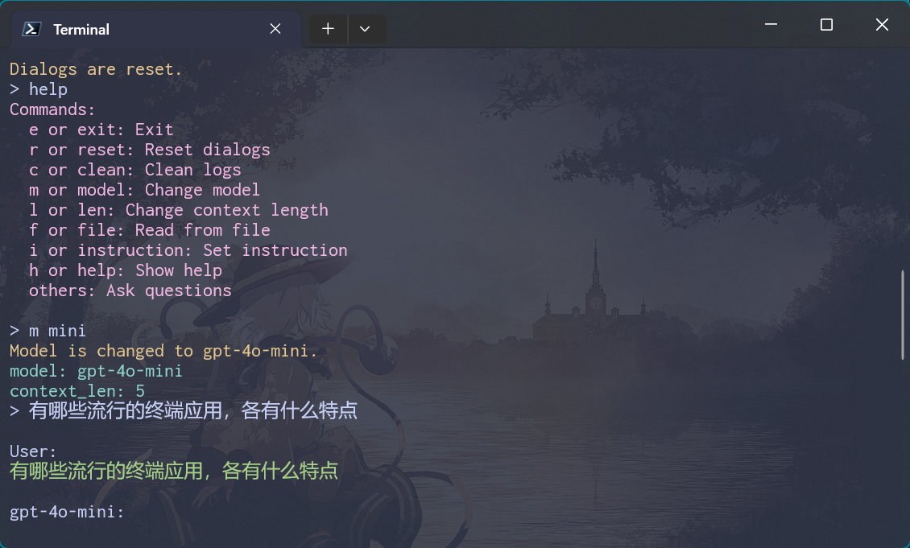
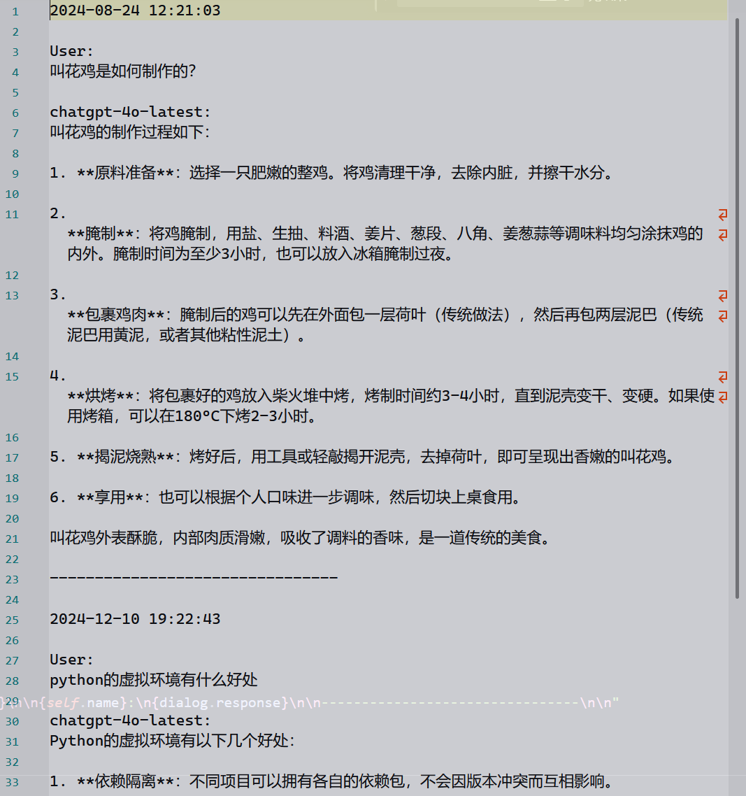

# 环境设置

1. 用文本编辑器打开`config.json`，填入`api_key`和`url`
2. 用文本编辑器打开`gpt.bat`，填入`cd /d "【替换为本文件夹的路径】"`的路径
3. 将`gpt.bat`随便放到任何文件夹下，只要确保该文件夹已被添加在`PATH`系统变量中。
4. 打开终端输入`gpt`，若出现`model: gpt-4o-mini ...`字样则设置成功

# 运行

在终端中输入`gpt`即可

保存的对话日志将保存在程序目录下的`log`文件夹中

# 指令手册

#### e/exit

退出程序

#### r/reset

重置上下文，即清空记忆

#### c/clean

清除日志

#### m/model + [模型名]

切换模型类型

目前支持：

+ gpt-4o-mini
+ gpt-4o
+ gpt-4-turbo

#### l/len + [上下文长度]

设定上下文长度，即记忆的最近对话个数，更早的对话会被遗忘。

#### f/file + [文本文件路径]

将文本文件内容作为输入提问

#### i/ins  + [指令]

设定给大模型的指令，本身不作为提问

例如：

`用户将输入若干python语句，你将模拟python解释器打印语句结果`

#### h/help

打印指令帮助

#### [其他内容]

向大模型提问

# 程序截图

终端：

日志：

# 博客介绍

可在[夜梦草](https://yemengcao.cc)中阅读